# Locked Decisions for Story d5ea4eb6-d92b-4940-83c7-c994039bfda7

## Type Mapping
## Hive → BigQuery Type Mapping Rules

### Scalar Type Mappings
| Hive Type | BigQuery Type | Notes |
|---|---|---|
| `STRING` | `STRING` | Direct 1:1 |
| `INT` | `INT64` | Hive INT (32-bit) widens to BQ INT64 |
| `BIGINT` | `INT64` | Direct 1:1 |
| `TINYINT` | `INT64` | Hive TINYINT (8-bit) widens to BQ INT64 |
| `BOOLEAN` | `BOOL` | Direct 1:1 |
| `DOUBLE` | `FLOAT64` | Direct 1:1 |
| `DECIMAL(p,s)` | `NUMERIC` | All DECIMAL variants (10,2), (14,2), (12,2), (8,2), (4,3), (5,4), (18,2) map to NUMERIC. BigQuery NUMERIC supports 29 digits before decimal, 9 after — sufficient for all source precisions. |
| `DATE` | `DATE` | Direct 1:1 |
| `TIMESTAMP` | `DATETIME` | Per AC #10: Hive TIMESTAMP → BigQuery DATETIME (no timezone). Note: synthetic partition columns use TIMESTAMP with timezone for partitioning purposes. |

### Complex Type Mappings (per locked MAP/STRUCT/ARRAY decision)
| Hive Type | BigQuery Type | Affected Tables |
|---|---|---|
| `MAP<STRING,STRING>` | `JSON` | `raw.mobile_events.properties`, `raw.product_catalog_feed.metadata`, `raw.email_campaign_clicks.utm`, `raw.driver_logs.extras`, `staging.parsed_loyalty_events.meta` |
| `STRUCT<...>` | `STRUCT<...>` | `raw.mobile_events.context`, `raw.email_campaign_clicks.geo`, `raw.driver_logs.gps` — field types mapped using scalar rules above |
| `ARRAY<STRUCT<...>>` | `ARRAY<STRUCT<...>>` | `raw.mobile_events.items`, `raw.supplier_invoices.line_items` — nested field types mapped using scalar rules (INT→INT64, DECIMAL(10,2)→NUMERIC) |
| `ARRAY<STRING>` | `ARRAY<STRING>` | `staging.fraud_scored.signals` |

### Partition Column Transformations (per locked Partitioning Strategy)

#### Pattern A: Single `date_ts STRING` → `ingest_ts TIMESTAMP`
Applies to 12 tables. The `date_ts STRING` (format `yyyyMMdd_HH`) partition column is **replaced** by a synthetic `ingest_ts TIMESTAMP` column, partitioned at **HOUR** granularity.

**Affected tables:** `raw.sales_retail`, `raw.omniture_logs`, `raw.pos_transactions`, `raw.loyalty_events`, `raw.product_catalog_feed` (feed_date→ingest_ts), `raw.email_campaign_clicks`, `raw.return_authorizations`, `raw.delivery_routes`, `raw.driver_logs`, `raw.customer_complaints`, `raw.chat_transcripts`, `staging.parsed_loyalty_events`, `staging.normalized_carrier_events`, `staging.warehouse_kpi_snapshot`

#### Pattern B: Multi-column date partitions → single collapsed column
| Table | Hive Partitions | BQ Partition Column | BQ CLUSTER BY |
|---|---|---|---|
| `raw.mobile_events` | `event_date STRING, hour_bucket TINYINT` | `event_ts TIMESTAMP` (HOUR granularity) | `hour_bucket` |
| `raw.supplier_invoices` | `feed_year INT, feed_month INT` | `invoice_month DATE` (MONTH granularity) | _(none)_ |
| `raw.inventory_movements` | `year INT, month INT, day INT` | `movement_date DATE` (DAY granularity) | _(none)_ |
| `raw.shipment_tracking` | `date_ts STRING, carrier_partition STRING` | `ingest_ts TIMESTAMP` (HOUR granularity) | `carrier_partition` |
| `raw.warehouse_picks` | `date_ts STRING, warehouse_id_partition STRING` | `ingest_ts TIMESTAMP` (HOUR granularity) | `warehouse_id_partition` |
| `staging.dedup_clickstream` | `date_ts STRING, country_partition STRING` | `event_date DATE` (DAY granularity) | `country_partition, user_id` |

#### Pattern C: Already-native DATE partitions (no change needed)
These staging tables already partition by a DATE column — carried over as-is:
`staging.cleansed_orders` (order_date), `staging.cleansed_customers` (load_date), `staging.cleansed_products` (load_date), `staging.geocoded_addresses` (load_date), `staging.merged_returns_cdc` (snapshot_date), `staging.fraud_scored` (score_date)

Also: `raw.returns_cdc` (snapshot_date DATE) — native, no change.

### Avro Tables → External Parquet Tables
`raw.customer_signups` and `raw.fraud_signals` are created as **BigQuery external tables** over GCS Parquet files (converted from Avro). Schema is auto-detected from Parquet footers. Partition columns (`signup_date`, `signal_date`) use hive-partitioned GCS paths.

### Legacy SerDe Tables → Native Tables via Parquet Transit
`raw.product_catalog_feed` (RCFile), `raw.supplier_invoices` (SequenceFile), `raw.loyalty_events` (RegexSerDe) are created as **native BigQuery managed tables** loaded via `bq load` from GCS Parquet transit output. Each DDL includes an `OPTIONS(description="...")` comment noting the Parquet transit load requirement.

### View SQL Translations
| Hive Function/Syntax | BigQuery GoogleSQL |
|---|---|
| `DATEDIFF(current_date(), to_date(col))` | `DATE_DIFF(CURRENT_DATE(), DATE(col), DAY)` |
| `date_format(date_sub(current_date(), 1), 'yyyyMMdd')` | `FORMAT_DATE('%Y%m%d', DATE_SUB(CURRENT_DATE(), INTERVAL 1 DAY))` |
| `date_ts` column reference in views | Replaced with `ingest_ts` (clean break, no aliasing) |
| Cross-database `raw.table` reference in staging view | Fully qualified `\`acme-lake-project.raw.table\`` |

## Validation Strategy
## DDL Validation Strategy

### 1. Dry-Run Validation (AC #9)
Every generated DDL file is validated via BigQuery dry-run against the scratch dataset `bq_scratch_schema_test`:

```bash
bq query --dry_run --use_legacy_sql=false < raw/sales_retail.sql
```

**Pass criteria**: Zero parse errors, zero type errors across all 30 DDL files.

**Automation**: A shell script (`validate_all_ddl.sh`) iterates over every `.sql` file in the output directory, runs the dry-run, and collects results into a pass/fail report. The script:
1. Creates datasets `bq_scratch_schema_test.raw` and `bq_scratch_schema_test.staging` if not present
2. Runs each table DDL as a dry-run (tables first, then views since views depend on tables)
3. Outputs a summary: `PASS: 30/30` or lists failures with error messages

### 2. Schema Parity Validation (AC #10, #11)
For each table, a comparison script runs:
- **Hive side**: `DESCRIBE FORMATTED <database>.<table>` on acme-lake
- **BigQuery side**: `bq show --schema <project>:<dataset>.<table>`

**Checks performed**:
1. **Column presence**: Every source column is present in target (except dropped partition columns replaced by synthetics)
2. **Type correctness**: Mapped types match the locked Type Mapping rules (STRING→STRING, INT→INT64, DECIMAL→NUMERIC, TIMESTAMP→DATETIME)
3. **No unexpected columns**: No columns added except documented synthetic partition columns (`ingest_ts`, `event_ts`, `invoice_month`, `movement_date`, `event_date`)
4. **Partition intent preserved**: Source partition semantics are preserved — hourly STRING partitions become TIMESTAMP HOUR partitions, multi-column partitions collapse correctly

### 3. Complex Type Spot-Checks (AC #2, #11)
Specific validation for the 5 MAP→JSON, 3 STRUCT, and 2 ARRAY columns:
- `raw.mobile_events`: Verify `properties` is JSON, `context` is STRUCT with 4 STRING fields, `items` is ARRAY<STRUCT> with correct nested types
- `raw.supplier_invoices`: Verify `line_items` is ARRAY<STRUCT<sku STRING, qty INT64, unit_price NUMERIC>>
- `raw.product_catalog_feed`: Verify `metadata` is JSON
- All MAP columns: Confirm JSON type (not STRING or ARRAY<STRUCT>)

### 4. View Dependency Validation
After table DDLs pass dry-run:
1. Run view DDLs and confirm they reference the correct fully-qualified table names
2. `raw.omniture` → references `acme-lake-project.raw.omniture_logs`
3. `raw.v_fraud_signals_recent` → references `acme-lake-project.raw.fraud_signals`
4. `staging.v_returns_pending` → references `acme-lake-project.raw.return_authorizations` (cross-dataset)

### 5. Edge Cases & Error Handling
- **Avro externals**: `customer_signups` and `fraud_signals` external table DDL is validated syntactically but cannot fully resolve schema until GCS Parquet files exist. The dry-run validates the `CREATE EXTERNAL TABLE ... OPTIONS(format='PARQUET', uris=[...])` syntax only.
- **Reserved words**: BigQuery column names are checked against GoogleSQL reserved words. Known safe: all source column names (`name`, `size`, `status`) are not reserved in GoogleSQL when unquoted, but the DDL generator will backtick-quote all column names defensively.
- **Table description comments**: Verify the 3 legacy-format tables include the `OPTIONS(description=...)` noting Parquet transit requirements.

## Data Mapping
## Complete Source → Target Schema Mapping

### BigQuery Target ER Diagram

```mermaid
erDiagram
    raw_sales_retail {
        STRING invoice_no
        STRING stock_code
        STRING description
        INT64 quantity
        STRING invoice_date
        NUMERIC unit_price "precision 10,2"
        STRING customer_id
        STRING country
        TIMESTAMP ingest_ts "PARTITION BY HOUR"
    }
    raw_omniture_logs {
        STRING col_1
        STRING col_2
        STRING col_3_thru_60 "60 STRING columns total"
        TIMESTAMP ingest_ts "PARTITION BY HOUR"
    }
    raw_omniture_view {
        DATETIME event_ts "from col_2"
        STRING ip "from col_8"
        STRING url "from col_13"
        STRING user_id "from col_14"
        STRING city "from col_50"
        STRING country "from col_51"
        STRING state "from col_53"
        TIMESTAMP ingest_ts "from base table"
    }
    raw_returns_cdc {
        INT64 return_id
        STRING invoice_no
        INT64 customer_sk
        DATETIME return_ts
        NUMERIC refund_amount "precision 12,2"
        STRING reason_code
        STRING status
        STRING op
        DATE snapshot_date "PARTITION BY DAY"
    }
    raw_pos_transactions {
        INT64 txn_id
        STRING store_id
        STRING register_id
        STRING cashier_id
        STRING customer_id
        STRING invoice_no
        DATETIME txn_ts
        INT64 line_count
        NUMERIC gross_amount "precision 14,2"
        NUMERIC discount_amount "precision 14,2"
        NUMERIC tax_amount "precision 14,2"
        STRING tender_type
        BOOL void_flag
        TIMESTAMP ingest_ts "PARTITION BY HOUR"
    }
    raw_inventory_movements {
        INT64 movement_id
        STRING sku
        STRING warehouse_id
        STRING bin_location
        STRING movement_type
        INT64 quantity
        DATETIME movement_ts
        STRING reference_doc
        STRING operator_id
        STRING reason_code
        DATE movement_date "PARTITION BY DAY synthetic"
    }
    raw_mobile_events {
        STRING event_id
        DATETIME event_ts_orig "renamed from event_ts"
        STRING user_id
        STRING app_version
        STRING device_type
        STRING platform
        JSON properties "was MAP"
        STRUCT context "ip,country,session_id,referrer"
        ARRAY items "ARRAY STRUCT sku-qty-price"
        INT64 hour_bucket "CLUSTER BY"
        TIMESTAMP event_ts "PARTITION BY HOUR synthetic"
    }
    raw_customer_signups {
        STRING auto_detected "schema from Parquet"
        TIMESTAMP ingest_ts "hive partition path"
    }
    raw_loyalty_events {
        STRING event_ts_str
        STRING member_id
        STRING event_type
        STRING points
        STRING store_id
        STRING tx_id
        STRING meta_raw
        TIMESTAMP ingest_ts "PARTITION BY HOUR"
    }
    raw_product_catalog_feed {
        STRING sku
        STRING supplier_id
        STRING upc
        STRING name
        STRING category
        STRING subcategory
        STRING color
        STRING size
        NUMERIC msrp "precision 10,2"
        NUMERIC cost "precision 10,2"
        DATE available_from
        DATE discontinued_at
        JSON metadata "was MAP"
        TIMESTAMP ingest_ts "PARTITION BY HOUR"
    }
    raw_supplier_invoices {
        STRING invoice_no
        STRING supplier_id
        DATE invoice_date
        DATE due_date
        NUMERIC total_amount "precision 14,2"
        STRING currency
        ARRAY line_items "STRUCT sku-qty-unit_price"
        STRING raw_xml
        DATE invoice_month "PARTITION BY MONTH synthetic"
    }
    raw_email_campaign_clicks {
        STRING campaign_id
        STRING send_id
        STRING recipient
        DATETIME clicked_at
        STRING click_url
        STRING user_agent
        STRING ip_address
        STRUCT geo "country,region,city"
        JSON utm "was MAP"
        TIMESTAMP ingest_ts "PARTITION BY HOUR"
    }
    raw_shipment_tracking {
        STRING tracking_no
        STRING carrier
        STRING invoice_no
        STRING customer_id
        DATETIME shipped_at
        DATETIME delivered_at
        STRING status
        STRING last_location
        DATETIME estimated_eta
        STRING carrier_partition "CLUSTER BY"
        TIMESTAMP ingest_ts "PARTITION BY HOUR"
    }
    raw_return_authorizations {
        STRING rma_id
        STRING customer_id
        STRING invoice_no
        STRING stock_code
        INT64 quantity
        STRING reason_code
        STRING reason_text
        DATETIME requested_at
        BOOL approved
        NUMERIC refund_amount "precision 12,2"
        TIMESTAMP ingest_ts "PARTITION BY HOUR"
    }
    raw_fraud_signals {
        STRING auto_detected "schema from Parquet"
        TIMESTAMP ingest_ts "hive partition path"
    }
    raw_warehouse_picks {
        INT64 pick_id
        STRING warehouse_id
        STRING bin_id
        STRING sku
        STRING picker_id
        INT64 quantity
        DATETIME picked_at
        INT64 duration_ms
        STRING warehouse_id_partition "CLUSTER BY"
        TIMESTAMP ingest_ts "PARTITION BY HOUR"
    }
    raw_delivery_routes {
        STRING route_id
        STRING driver_id
        STRING vehicle_id
        INT64 planned_stops
        INT64 actual_stops
        NUMERIC miles_driven "precision 8,2"
        NUMERIC fuel_used "precision 8,2"
        DATETIME start_ts
        DATETIME end_ts
        TIMESTAMP ingest_ts "PARTITION BY HOUR"
    }
    raw_driver_logs {
        STRING driver_id
        DATETIME event_ts
        STRING event_type
        STRUCT gps "lat FLOAT64 lon FLOAT64"
        STRING notes
        JSON extras "was MAP"
        TIMESTAMP ingest_ts "PARTITION BY HOUR"
    }
    raw_customer_complaints {
        STRING complaint_id
        STRING customer_id
        STRING invoice_no
        STRING channel
        STRING severity
        STRING summary
        STRING body
        DATETIME created_at
        DATETIME resolved_at
        INT64 csat_score
        TIMESTAMP ingest_ts "PARTITION BY HOUR"
    }
    raw_chat_transcripts {
        STRING chat_id
        STRING customer_id
        STRING agent_id
        DATETIME started_at
        DATETIME ended_at
        INT64 duration_sec
        INT64 message_count
        STRING transcript
        NUMERIC sentiment "precision 4,3"
        TIMESTAMP ingest_ts "PARTITION BY HOUR"
    }
    raw_omniture_logs ||--|| raw_omniture_view : "VIEW"
    raw_fraud_signals ||--|| raw_v_fraud_signals_recent : "VIEW"
    raw_return_authorizations ||--|| staging_v_returns_pending : "cross-dataset VIEW"
    raw_v_fraud_signals_recent {
        STRING all_columns "SELECT star"
        TIMESTAMP ingest_ts "WHERE filter"
    }
    staging_cleansed_orders {
        STRING order_id
        STRING customer_id
        STRING invoice_no
        DATETIME txn_ts
        INT64 line_count
        NUMERIC gross_amount "precision 14,2"
        NUMERIC discount "precision 14,2"
        NUMERIC tax "precision 14,2"
        NUMERIC net_amount "precision 14,2"
        STRING tender_type
        STRING source_feed
        DATE order_date "PARTITION BY DAY native"
    }
    staging_cleansed_customers {
        STRING customer_id
        STRING email_norm
        STRING phone_norm
        STRING first_name
        STRING last_name
        STRING addr_line1
        STRING addr_city
        STRING addr_region
        STRING addr_country
        STRING addr_postal
        FLOAT64 geocoded_lat
        FLOAT64 geocoded_lon
        DATETIME eff_from_ts
        STRING record_hash
        DATE load_date "PARTITION BY DAY native"
    }
    staging_cleansed_products {
        STRING sku
        STRING upc
        STRING name_norm
        STRING category_norm
        STRING subcategory
        STRING color_norm
        STRING size_norm
        NUMERIC msrp "precision 10,2"
        NUMERIC cost "precision 10,2"
        STRING supplier_id
        BOOL available
        DATE load_date "PARTITION BY DAY native"
    }
    staging_dedup_clickstream {
        STRING session_id
        STRING user_id
        DATETIME event_ts
        STRING page_url
        STRING referrer_url
        STRING ip
        STRING country
        NUMERIC bot_score "precision 4,3"
        STRING device_type
        STRING country_partition "CLUSTER BY"
        DATE event_date "PARTITION BY DAY"
    }
    staging_geocoded_addresses {
        STRING raw_addr_hash
        STRING addr_line1
        STRING addr_city
        STRING addr_region
        STRING addr_country
        STRING addr_postal
        FLOAT64 lat
        FLOAT64 lon
        NUMERIC confidence "precision 4,3"
        STRING provider
        DATE load_date "PARTITION BY DAY native"
    }
    staging_parsed_loyalty_events {
        DATETIME event_ts
        STRING member_id
        STRING event_type
        INT64 points
        STRING store_id
        STRING tx_id
        JSON meta "was MAP"
        TIMESTAMP ingest_ts "PARTITION BY HOUR"
    }
    staging_merged_returns_cdc {
        INT64 return_id
        STRING invoice_no
        INT64 customer_sk
        DATETIME return_ts
        NUMERIC refund_amount "precision 12,2"
        STRING reason_code
        STRING status
        BOOL is_deleted
        DATE snapshot_date "PARTITION BY DAY native"
    }
    staging_normalized_carrier_events {
        STRING tracking_no
        STRING carrier
        STRING event_type
        DATETIME event_ts
        STRING location_city
        STRING location_region
        STRING location_country
        TIMESTAMP ingest_ts "PARTITION BY HOUR"
    }
    staging_fraud_scored {
        INT64 txn_id
        STRING customer_id
        NUMERIC fraud_score "precision 5,4"
        STRING risk_band
        ARRAY signals "ARRAY of STRING"
        DATETIME scored_at
        DATE score_date "PARTITION BY DAY native"
    }
    staging_warehouse_kpi_snapshot {
        STRING warehouse_id
        DATETIME snapshot_ts
        INT64 units_in
        INT64 units_picked
        INT64 units_shipped
        NUMERIC pick_rate_uph "precision 8,2"
        INT64 backlog_units
        INT64 avg_pick_ms
        TIMESTAMP ingest_ts "PARTITION BY HOUR"
    }
    staging_v_returns_pending {
        STRING rma_id
        STRING customer_id
        STRING invoice_no
        STRING stock_code
        INT64 quantity
        DATETIME requested_at
        INT64 days_pending "DATE_DIFF computed"
    }
```



### Column Mapping — Key Transformations by Table

#### raw.sales_retail (AC #1)
| Hive Column | Hive Type | BQ Column | BQ Type | Transform |
|---|---|---|---|---|
| invoice_no | STRING | invoice_no | STRING | — |
| stock_code | STRING | stock_code | STRING | — |
| description | STRING | description | STRING | — |
| quantity | INT | quantity | INT64 | widen |
| invoice_date | STRING | invoice_date | STRING | — |
| unit_price | DECIMAL(10,2) | unit_price | NUMERIC | — |
| customer_id | STRING | customer_id | STRING | — |
| country | STRING | country | STRING | — |
| date_ts _(partition)_ | STRING | ingest_ts _(partition)_ | TIMESTAMP | parse yyyyMMdd_HH, PARTITION BY HOUR |

#### raw.mobile_events (AC #2) — complex types + multi-partition collapse
| Hive Column | Hive Type | BQ Column | BQ Type | Transform |
|---|---|---|---|---|
| event_id | STRING | event_id | STRING | — |
| event_ts | TIMESTAMP | event_ts_orig | DATETIME | **renamed** to avoid partition col clash |
| user_id..platform | STRING | same | STRING | — |
| properties | MAP&lt;STRING,STRING&gt; | properties | JSON | MAP→JSON |
| context | STRUCT&lt;ip,country,session_id,referrer&gt; | context | STRUCT&lt;ip STRING,country STRING,session_id STRING,referrer STRING&gt; | — |
| items | ARRAY&lt;STRUCT&lt;sku:STRING,qty:INT,price:DECIMAL(10,2)&gt;&gt; | items | ARRAY&lt;STRUCT&lt;sku STRING,qty INT64,price NUMERIC&gt;&gt; | nested mapping |
| event_date _(partition)_ | STRING | _(dropped)_ | — | collapsed into event_ts |
| hour_bucket _(partition)_ | TINYINT | hour_bucket | INT64 | retained as data col + CLUSTER BY |
| _(synthetic)_ | — | event_ts _(partition)_ | TIMESTAMP | PARTITION BY HOUR |

#### raw.product_catalog_feed (AC #3) — RCFile + MAP
| Hive Column | Hive Type | BQ Column | BQ Type | Transform |
|---|---|---|---|---|
| sku..discontinued_at | various | same | mapped types | scalar rules |
| metadata | MAP&lt;STRING,STRING&gt; | metadata | JSON | MAP→JSON |
| feed_date _(partition)_ | STRING | ingest_ts _(partition)_ | TIMESTAMP | PARTITION BY HOUR |
| _table option_ | — | — | — | `OPTIONS(description="Parquet transit load required - source is RCFile")` |

#### raw.supplier_invoices (AC #4) — SequenceFile + ARRAY + multi-partition
| Hive Column | Hive Type | BQ Column | BQ Type | Transform |
|---|---|---|---|---|
| invoice_no..currency | various | same | mapped types | — |
| line_items | ARRAY&lt;STRUCT&lt;sku:STRING,qty:INT,unit_price:DECIMAL(10,2)&gt;&gt; | line_items | ARRAY&lt;STRUCT&lt;sku STRING,qty INT64,unit_price NUMERIC&gt;&gt; | nested mapping |
| raw_xml | STRING | raw_xml | STRING | — |
| feed_year _(partition)_ | INT | _(dropped)_ | — | collapsed into invoice_month |
| feed_month _(partition)_ | INT | _(dropped)_ | — | collapsed into invoice_month |
| _(synthetic)_ | — | invoice_month _(partition)_ | DATE | PARTITION BY MONTH |
| _table option_ | — | — | — | `OPTIONS(description="Parquet transit load required - source is SequenceFile")` |

#### staging.dedup_clickstream (AC #5) — bucketed + multi-partition
| Hive Column | Hive Type | BQ Column | BQ Type | Transform |
|---|---|---|---|---|
| session_id..device_type | various | same | mapped types | scalar rules |
| date_ts _(partition)_ | STRING | event_date _(partition)_ | DATE | PARTITION BY DAY |
| country_partition _(partition)_ | STRING | country_partition | STRING | retained + CLUSTER BY |
| CLUSTERED BY (user_id) INTO 16 BUCKETS | — | CLUSTER BY country_partition, user_id | — | bucketing→clustering |

#### staging.parsed_loyalty_events (AC #6) — MAP
| Hive Column | Hive Type | BQ Column | BQ Type | Transform |
|---|---|---|---|---|
| meta | MAP&lt;STRING,STRING&gt; | meta | JSON | MAP→JSON |
| date_ts _(partition)_ | STRING | ingest_ts _(partition)_ | TIMESTAMP | PARTITION BY HOUR |

#### raw.omniture VIEW (AC #7)
Translated to `CREATE OR REPLACE VIEW \`acme-lake-project.raw.omniture\`` referencing `\`acme-lake-project.raw.omniture_logs\``, projecting same aliased columns, replacing `date_ts` with `ingest_ts`.

#### staging.v_returns_pending VIEW (AC #8) — cross-dataset
Translated to `CREATE OR REPLACE VIEW \`acme-lake-project.staging.v_returns_pending\`` referencing `\`acme-lake-project.raw.return_authorizations\``. Hive `DATEDIFF(current_date(), to_date(r.requested_at))` → BQ `DATE_DIFF(CURRENT_DATE(), DATE(r.requested_at), DAY)`.

### Object Count Summary
| Dataset | Native Tables | External Tables | Views | Total DDL Files |
|---|---|---|---|---|
| raw | 15 | 2 | 2 | 19 |
| staging | 10 | 0 | 1 | 11 |
| **Total** | **25** | **2** | **3** | **30** |

## Output File Structure
## Output File Structure

### Directory Layout
All generated DDL files are written to `/workspace/project/bigquery/` with the following structure:

```
bigquery/
├── raw/
│   ├── tables/
│   │   ├── sales_retail.sql
│   │   ├── omniture_logs.sql
│   │   ├── returns_cdc.sql
│   │   ├── pos_transactions.sql
│   │   ├── inventory_movements.sql
│   │   ├── mobile_events.sql
│   │   ├── loyalty_events.sql
│   │   ├── product_catalog_feed.sql
│   │   ├── supplier_invoices.sql
│   │   ├── email_campaign_clicks.sql
│   │   ├── shipment_tracking.sql
│   │   ├── return_authorizations.sql
│   │   ├── warehouse_picks.sql
│   │   ├── delivery_routes.sql
│   │   ├── driver_logs.sql
│   │   ├── customer_complaints.sql
│   │   └── chat_transcripts.sql
│   ├── external/
│   │   ├── customer_signups.sql
│   │   └── fraud_signals.sql
│   └── views/
│       ├── omniture.sql
│       └── v_fraud_signals_recent.sql
├── staging/
│   ├── tables/
│   │   ├── cleansed_orders.sql
│   │   ├── cleansed_customers.sql
│   │   ├── cleansed_products.sql
│   │   ├── dedup_clickstream.sql
│   │   ├── geocoded_addresses.sql
│   │   ├── parsed_loyalty_events.sql
│   │   ├── merged_returns_cdc.sql
│   │   ├── normalized_carrier_events.sql
│   │   ├── fraud_scored.sql
│   │   └── warehouse_kpi_snapshot.sql
│   └── views/
│       └── v_returns_pending.sql
├── datasets/
│   ├── create_raw_dataset.sql
│   └── create_staging_dataset.sql
└── scripts/
    └── validate_all_ddl.sh
```

### File Naming Convention
- One `.sql` file per database object, named exactly matching the Hive table/view name (lowercase, underscores)
- Subdirectories separate `tables/`, `external/` (for Parquet external tables), and `views/`
- Dataset creation DDL in `datasets/` — creates `acme-lake-project.raw` and `acme-lake-project.staging` BigQuery datasets

### DDL File Format
Each `.sql` file contains:
1. A header comment block with source table name, source file reference, and any migration notes
2. A single `CREATE OR REPLACE TABLE` (or `CREATE EXTERNAL TABLE` or `CREATE OR REPLACE VIEW`) statement
3. Fully qualified table references using backtick notation: `` `acme-lake-project.raw.table_name` ``

Example header:
```sql
-- Source: raw.sales_retail
-- Origin: clusters/acme-lake/hive/02-raw-external-tables.hql
-- Partition: date_ts STRING -> ingest_ts TIMESTAMP (HOUR granularity)
-- Storage: TEXTFILE -> BigQuery native (managed)
```

### Execution Order
The `validate_all_ddl.sh` script enforces dependency ordering:
1. **Phase 1**: Dataset creation (`datasets/*.sql`)
2. **Phase 2**: All tables — raw tables first, then staging tables (`raw/tables/*.sql`, `raw/external/*.sql`, `staging/tables/*.sql`)
3. **Phase 3**: All views — raw views first, then staging views (`raw/views/*.sql`, `staging/views/*.sql`) — since `staging.v_returns_pending` depends on `raw.return_authorizations`

### Total: 30 DDL files + 2 dataset files + 1 validation script = 33 files
