# Data Mapping

## Complete Source → Target Schema Mapping

### BigQuery Target ER Diagram

```mermaid
erDiagram
    raw_sales_retail {
        STRING invoice_no
        STRING stock_code
        STRING description
        INT64 quantity
        STRING invoice_date
        NUMERIC unit_price "precision 10,2"
        STRING customer_id
        STRING country
        TIMESTAMP ingest_ts "PARTITION BY HOUR"
    }
    raw_omniture_logs {
        STRING col_1
        STRING col_2
        STRING col_3_thru_60 "60 STRING columns total"
        TIMESTAMP ingest_ts "PARTITION BY HOUR"
    }
    raw_omniture_view {
        DATETIME event_ts "from col_2"
        STRING ip "from col_8"
        STRING url "from col_13"
        STRING user_id "from col_14"
        STRING city "from col_50"
        STRING country "from col_51"
        STRING state "from col_53"
        TIMESTAMP ingest_ts "from base table"
    }
    raw_returns_cdc {
        INT64 return_id
        STRING invoice_no
        INT64 customer_sk
        DATETIME return_ts
        NUMERIC refund_amount "precision 12,2"
        STRING reason_code
        STRING status
        STRING op
        DATE snapshot_date "PARTITION BY DAY"
    }
    raw_pos_transactions {
        INT64 txn_id
        STRING store_id
        STRING register_id
        STRING cashier_id
        STRING customer_id
        STRING invoice_no
        DATETIME txn_ts
        INT64 line_count
        NUMERIC gross_amount "precision 14,2"
        NUMERIC discount_amount "precision 14,2"
        NUMERIC tax_amount "precision 14,2"
        STRING tender_type
        BOOL void_flag
        TIMESTAMP ingest_ts "PARTITION BY HOUR"
    }
    raw_inventory_movements {
        INT64 movement_id
        STRING sku
        STRING warehouse_id
        STRING bin_location
        STRING movement_type
        INT64 quantity
        DATETIME movement_ts
        STRING reference_doc
        STRING operator_id
        STRING reason_code
        DATE movement_date "PARTITION BY DAY synthetic"
    }
    raw_mobile_events {
        STRING event_id
        DATETIME event_ts_orig "renamed from event_ts"
        STRING user_id
        STRING app_version
        STRING device_type
        STRING platform
        JSON properties "was MAP"
        STRUCT context "ip,country,session_id,referrer"
        ARRAY items "ARRAY STRUCT sku-qty-price"
        INT64 hour_bucket "CLUSTER BY"
        TIMESTAMP event_ts "PARTITION BY HOUR synthetic"
    }
    raw_customer_signups {
        STRING auto_detected "schema from Parquet"
        TIMESTAMP ingest_ts "hive partition path"
    }
    raw_loyalty_events {
        STRING event_ts_str
        STRING member_id
        STRING event_type
        STRING points
        STRING store_id
        STRING tx_id
        STRING meta_raw
        TIMESTAMP ingest_ts "PARTITION BY HOUR"
    }
    raw_product_catalog_feed {
        STRING sku
        STRING supplier_id
        STRING upc
        STRING name
        STRING category
        STRING subcategory
        STRING color
        STRING size
        NUMERIC msrp "precision 10,2"
        NUMERIC cost "precision 10,2"
        DATE available_from
        DATE discontinued_at
        JSON metadata "was MAP"
        TIMESTAMP ingest_ts "PARTITION BY HOUR"
    }
    raw_supplier_invoices {
        STRING invoice_no
        STRING supplier_id
        DATE invoice_date
        DATE due_date
        NUMERIC total_amount "precision 14,2"
        STRING currency
        ARRAY line_items "STRUCT sku-qty-unit_price"
        STRING raw_xml
        DATE invoice_month "PARTITION BY MONTH synthetic"
    }
    raw_email_campaign_clicks {
        STRING campaign_id
        STRING send_id
        STRING recipient
        DATETIME clicked_at
        STRING click_url
        STRING user_agent
        STRING ip_address
        STRUCT geo "country,region,city"
        JSON utm "was MAP"
        TIMESTAMP ingest_ts "PARTITION BY HOUR"
    }
    raw_shipment_tracking {
        STRING tracking_no
        STRING carrier
        STRING invoice_no
        STRING customer_id
        DATETIME shipped_at
        DATETIME delivered_at
        STRING status
        STRING last_location
        DATETIME estimated_eta
        STRING carrier_partition "CLUSTER BY"
        TIMESTAMP ingest_ts "PARTITION BY HOUR"
    }
    raw_return_authorizations {
        STRING rma_id
        STRING customer_id
        STRING invoice_no
        STRING stock_code
        INT64 quantity
        STRING reason_code
        STRING reason_text
        DATETIME requested_at
        BOOL approved
        NUMERIC refund_amount "precision 12,2"
        TIMESTAMP ingest_ts "PARTITION BY HOUR"
    }
    raw_fraud_signals {
        STRING auto_detected "schema from Parquet"
        TIMESTAMP ingest_ts "hive partition path"
    }
    raw_warehouse_picks {
        INT64 pick_id
        STRING warehouse_id
        STRING bin_id
        STRING sku
        STRING picker_id
        INT64 quantity
        DATETIME picked_at
        INT64 duration_ms
        STRING warehouse_id_partition "CLUSTER BY"
        TIMESTAMP ingest_ts "PARTITION BY HOUR"
    }
    raw_delivery_routes {
        STRING route_id
        STRING driver_id
        STRING vehicle_id
        INT64 planned_stops
        INT64 actual_stops
        NUMERIC miles_driven "precision 8,2"
        NUMERIC fuel_used "precision 8,2"
        DATETIME start_ts
        DATETIME end_ts
        TIMESTAMP ingest_ts "PARTITION BY HOUR"
    }
    raw_driver_logs {
        STRING driver_id
        DATETIME event_ts
        STRING event_type
        STRUCT gps "lat FLOAT64 lon FLOAT64"
        STRING notes
        JSON extras "was MAP"
        TIMESTAMP ingest_ts "PARTITION BY HOUR"
    }
    raw_customer_complaints {
        STRING complaint_id
        STRING customer_id
        STRING invoice_no
        STRING channel
        STRING severity
        STRING summary
        STRING body
        DATETIME created_at
        DATETIME resolved_at
        INT64 csat_score
        TIMESTAMP ingest_ts "PARTITION BY HOUR"
    }
    raw_chat_transcripts {
        STRING chat_id
        STRING customer_id
        STRING agent_id
        DATETIME started_at
        DATETIME ended_at
        INT64 duration_sec
        INT64 message_count
        STRING transcript
        NUMERIC sentiment "precision 4,3"
        TIMESTAMP ingest_ts "PARTITION BY HOUR"
    }
    raw_omniture_logs ||--|| raw_omniture_view : "VIEW"
    raw_fraud_signals ||--|| raw_v_fraud_signals_recent : "VIEW"
    raw_return_authorizations ||--|| staging_v_returns_pending : "cross-dataset VIEW"
    raw_v_fraud_signals_recent {
        STRING all_columns "SELECT star"
        TIMESTAMP ingest_ts "WHERE filter"
    }
    staging_cleansed_orders {
        STRING order_id
        STRING customer_id
        STRING invoice_no
        DATETIME txn_ts
        INT64 line_count
        NUMERIC gross_amount "precision 14,2"
        NUMERIC discount "precision 14,2"
        NUMERIC tax "precision 14,2"
        NUMERIC net_amount "precision 14,2"
        STRING tender_type
        STRING source_feed
        DATE order_date "PARTITION BY DAY native"
    }
    staging_cleansed_customers {
        STRING customer_id
        STRING email_norm
        STRING phone_norm
        STRING first_name
        STRING last_name
        STRING addr_line1
        STRING addr_city
        STRING addr_region
        STRING addr_country
        STRING addr_postal
        FLOAT64 geocoded_lat
        FLOAT64 geocoded_lon
        DATETIME eff_from_ts
        STRING record_hash
        DATE load_date "PARTITION BY DAY native"
    }
    staging_cleansed_products {
        STRING sku
        STRING upc
        STRING name_norm
        STRING category_norm
        STRING subcategory
        STRING color_norm
        STRING size_norm
        NUMERIC msrp "precision 10,2"
        NUMERIC cost "precision 10,2"
        STRING supplier_id
        BOOL available
        DATE load_date "PARTITION BY DAY native"
    }
    staging_dedup_clickstream {
        STRING session_id
        STRING user_id
        DATETIME event_ts
        STRING page_url
        STRING referrer_url
        STRING ip
        STRING country
        NUMERIC bot_score "precision 4,3"
        STRING device_type
        STRING country_partition "CLUSTER BY"
        DATE event_date "PARTITION BY DAY"
    }
    staging_geocoded_addresses {
        STRING raw_addr_hash
        STRING addr_line1
        STRING addr_city
        STRING addr_region
        STRING addr_country
        STRING addr_postal
        FLOAT64 lat
        FLOAT64 lon
        NUMERIC confidence "precision 4,3"
        STRING provider
        DATE load_date "PARTITION BY DAY native"
    }
    staging_parsed_loyalty_events {
        DATETIME event_ts
        STRING member_id
        STRING event_type
        INT64 points
        STRING store_id
        STRING tx_id
        JSON meta "was MAP"
        TIMESTAMP ingest_ts "PARTITION BY HOUR"
    }
    staging_merged_returns_cdc {
        INT64 return_id
        STRING invoice_no
        INT64 customer_sk
        DATETIME return_ts
        NUMERIC refund_amount "precision 12,2"
        STRING reason_code
        STRING status
        BOOL is_deleted
        DATE snapshot_date "PARTITION BY DAY native"
    }
    staging_normalized_carrier_events {
        STRING tracking_no
        STRING carrier
        STRING event_type
        DATETIME event_ts
        STRING location_city
        STRING location_region
        STRING location_country
        TIMESTAMP ingest_ts "PARTITION BY HOUR"
    }
    staging_fraud_scored {
        INT64 txn_id
        STRING customer_id
        NUMERIC fraud_score "precision 5,4"
        STRING risk_band
        ARRAY signals "ARRAY of STRING"
        DATETIME scored_at
        DATE score_date "PARTITION BY DAY native"
    }
    staging_warehouse_kpi_snapshot {
        STRING warehouse_id
        DATETIME snapshot_ts
        INT64 units_in
        INT64 units_picked
        INT64 units_shipped
        NUMERIC pick_rate_uph "precision 8,2"
        INT64 backlog_units
        INT64 avg_pick_ms
        TIMESTAMP ingest_ts "PARTITION BY HOUR"
    }
    staging_v_returns_pending {
        STRING rma_id
        STRING customer_id
        STRING invoice_no
        STRING stock_code
        INT64 quantity
        DATETIME requested_at
        INT64 days_pending "DATE_DIFF computed"
    }
```

### Column Mapping — Key Transformations by Table

#### raw.sales_retail (AC #1)
| Hive Column | Hive Type | BQ Column | BQ Type | Transform |
|---|---|---|---|---|
| invoice_no | STRING | invoice_no | STRING | — |
| stock_code | STRING | stock_code | STRING | — |
| description | STRING | description | STRING | — |
| quantity | INT | quantity | INT64 | widen |
| invoice_date | STRING | invoice_date | STRING | — |
| unit_price | DECIMAL(10,2) | unit_price | NUMERIC | — |
| customer_id | STRING | customer_id | STRING | — |
| country | STRING | country | STRING | — |
| date_ts _(partition)_ | STRING | ingest_ts _(partition)_ | TIMESTAMP | parse yyyyMMdd_HH, PARTITION BY HOUR |

#### raw.mobile_events (AC #2) — complex types + multi-partition collapse
| Hive Column | Hive Type | BQ Column | BQ Type | Transform |
|---|---|---|---|---|
| event_id | STRING | event_id | STRING | — |
| event_ts | TIMESTAMP | event_ts_orig | DATETIME | **renamed** to avoid partition col clash |
| user_id..platform | STRING | same | STRING | — |
| properties | MAP&lt;STRING,STRING&gt; | properties | JSON | MAP→JSON |
| context | STRUCT&lt;ip,country,session_id,referrer&gt; | context | STRUCT&lt;ip STRING,country STRING,session_id STRING,referrer STRING&gt; | — |
| items | ARRAY&lt;STRUCT&lt;sku:STRING,qty:INT,price:DECIMAL(10,2)&gt;&gt; | items | ARRAY&lt;STRUCT&lt;sku STRING,qty INT64,price NUMERIC&gt;&gt; | nested mapping |
| event_date _(partition)_ | STRING | _(dropped)_ | — | collapsed into event_ts |
| hour_bucket _(partition)_ | TINYINT | hour_bucket | INT64 | retained as data col + CLUSTER BY |
| _(synthetic)_ | — | event_ts _(partition)_ | TIMESTAMP | PARTITION BY HOUR |

#### raw.product_catalog_feed (AC #3) — RCFile + MAP
| Hive Column | Hive Type | BQ Column | BQ Type | Transform |
|---|---|---|---|---|
| sku..discontinued_at | various | same | mapped types | scalar rules |
| metadata | MAP&lt;STRING,STRING&gt; | metadata | JSON | MAP→JSON |
| feed_date _(partition)_ | STRING | ingest_ts _(partition)_ | TIMESTAMP | PARTITION BY HOUR |
| _table option_ | — | — | — | `OPTIONS(description="Parquet transit load required - source is RCFile")` |

#### raw.supplier_invoices (AC #4) — SequenceFile + ARRAY + multi-partition
| Hive Column | Hive Type | BQ Column | BQ Type | Transform |
|---|---|---|---|---|
| invoice_no..currency | various | same | mapped types | — |
| line_items | ARRAY&lt;STRUCT&lt;sku:STRING,qty:INT,unit_price:DECIMAL(10,2)&gt;&gt; | line_items | ARRAY&lt;STRUCT&lt;sku STRING,qty INT64,unit_price NUMERIC&gt;&gt; | nested mapping |
| raw_xml | STRING | raw_xml | STRING | — |
| feed_year _(partition)_ | INT | _(dropped)_ | — | collapsed into invoice_month |
| feed_month _(partition)_ | INT | _(dropped)_ | — | collapsed into invoice_month |
| _(synthetic)_ | — | invoice_month _(partition)_ | DATE | PARTITION BY MONTH |
| _table option_ | — | — | — | `OPTIONS(description="Parquet transit load required - source is SequenceFile")` |

#### staging.dedup_clickstream (AC #5) — bucketed + multi-partition
| Hive Column | Hive Type | BQ Column | BQ Type | Transform |
|---|---|---|---|---|
| session_id..device_type | various | same | mapped types | scalar rules |
| date_ts _(partition)_ | STRING | event_date _(partition)_ | DATE | PARTITION BY DAY |
| country_partition _(partition)_ | STRING | country_partition | STRING | retained + CLUSTER BY |
| CLUSTERED BY (user_id) INTO 16 BUCKETS | — | CLUSTER BY country_partition, user_id | — | bucketing→clustering |

#### staging.parsed_loyalty_events (AC #6) — MAP
| Hive Column | Hive Type | BQ Column | BQ Type | Transform |
|---|---|---|---|---|
| meta | MAP&lt;STRING,STRING&gt; | meta | JSON | MAP→JSON |
| date_ts _(partition)_ | STRING | ingest_ts _(partition)_ | TIMESTAMP | PARTITION BY HOUR |

#### raw.omniture VIEW (AC #7)
Translated to `CREATE OR REPLACE VIEW \`acme-lake-project.raw.omniture\`` referencing `\`acme-lake-project.raw.omniture_logs\``, projecting same aliased columns, replacing `date_ts` with `ingest_ts`.

#### staging.v_returns_pending VIEW (AC #8) — cross-dataset
Translated to `CREATE OR REPLACE VIEW \`acme-lake-project.staging.v_returns_pending\`` referencing `\`acme-lake-project.raw.return_authorizations\``. Hive `DATEDIFF(current_date(), to_date(r.requested_at))` → BQ `DATE_DIFF(CURRENT_DATE(), DATE(r.requested_at), DAY)`.

### Object Count Summary
| Dataset | Native Tables | External Tables | Views | Total DDL Files |
|---|---|---|---|---|
| raw | 15 | 2 | 2 | 19 |
| staging | 10 | 0 | 1 | 11 |
| **Total** | **25** | **2** | **3** | **30** |
